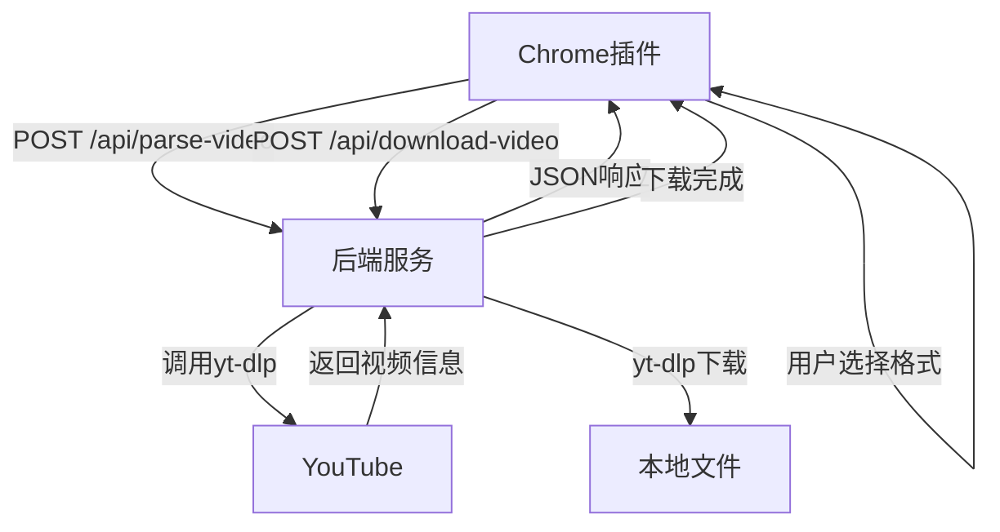

# 🎬 前后端集成指南

## 📋 完整集成步骤

### 步骤1：启动后端服务

```bash
# 进入后端目录
cd yifu-tube-backend

# 确保yt-dlp.exe在该目录中
# 下载地址: https://github.com/yt-dlp/yt-dlp/releases

# 安装依赖并启动
npm install
npm start
```

**成功标志：**
```
🎬 易弗YouTube视频下载器后端服务
==================================================
🚀 服务器已启动！
📱 访问地址: http://localhost:3000
✅ yt-dlp 已准备就绪
==================================================
```

### 步骤2：切换插件到后端版本

```bash
# 在Chrome插件目录中运行
cd yifu-youtube-downloader
switch-to-backend.bat
```

这会：
- ✅ 备份原始文件
- ✅ 切换到后端API版本
- ✅ 更新所有必要文件

### 步骤3：重新加载Chrome插件

1. **打开Chrome扩展管理页面**
   ```
   chrome://extensions/
   ```

2. **启用开发者模式**（如果未启用）

3. **重新加载插件**
   - 找到"易弗YouTube视频下载"插件
   - 点击"重新加载"按钮

### 步骤4：测试集成功能

1. **打开插件**
   - 点击Chrome工具栏中的插件图标
   - 应该看到"🚀 后端API版本"标识

2. **测试解析功能**
   ```
   测试URL: https://www.youtube.com/watch?v=HiQul9_vmsc
   ```
   - 粘贴URL到输入框
   - 点击"解析视频"
   - 应该显示"后端服务连接成功！"
   - 视频信息应该正确显示

3. **测试下载功能**
   - 选择一个格式
   - 点击"下载视频"
   - 应该显示"下载成功！文件已保存到后端服务器"

## 🔧 文件结构说明

### 后端文件（yifu-tube-backend/）
```
yifu-tube-backend/
├── 📄 package.json         # npm配置
├── 🚀 server.js            # 主服务器
├── 📖 README.md            # 详细文档
├── ⚡ QUICK_START.md       # 快速指南
├── 🔧 setup.bat            # 自动安装
├── 🌐 public/index.html    # 测试页面
├── 📁 downloads/           # 下载目录
└── 📦 yt-dlp.exe          # 下载引擎
```

### 前端文件（yifu-youtube-downloader/）
```
yifu-youtube-downloader/
├── 📄 popup.html           # 界面（自动切换）
├── 🎯 popup.js             # 主脚本（自动切换）
├── 🔄 background.js        # 后台脚本（自动切换）
├── 🎨 popup.css            # 样式（已更新）
├── ⚙️ manifest.json        # 配置（已更新权限）
│
├── 🚀 popup-backend.html   # 后端版界面
├── 🚀 popup-backend.js     # 后端版脚本
├── 🚀 background-backend.js # 后端版后台
│
├── 🔄 switch-to-backend.bat # 切换到后端版本
├── 🔙 switch-to-original.bat # 切换回原版
│
└── 📖 INTEGRATION_GUIDE.md # 本指南
```

## 🚀 API集成说明

### 主要变化

1. **解析功能**
   - ❌ 旧版：前端解析HTML（不稳定）
   - ✅ 新版：后端yt-dlp解析（稳定可靠）

2. **下载功能**
   - ❌ 旧版：Chrome下载API（限制多）
   - ✅ 新版：后端yt-dlp下载（真实下载）

3. **错误处理**
   - ❌ 旧版：简单错误提示
   - ✅ 新版：详细错误分析和解决建议

### API调用流程



## 🧪 测试清单

### ✅ 基础功能测试

- [ ] 后端服务启动成功
- [ ] 插件连接后端成功
- [ ] YouTube URL解析成功
- [ ] 视频信息显示正确
- [ ] 格式选项正确填充
- [ ] 下载功能正常工作

### ✅ 错误处理测试

- [ ] 后端服务未启动时的错误提示
- [ ] 无效URL的错误处理
- [ ] 网络错误的处理
- [ ] 视频不可用时的处理

### ✅ 历史记录测试

- [ ] 成功下载记录保存
- [ ] 失败下载记录保存
- [ ] 历史记录清除功能

## 🔄 版本切换

### 切换到后端版本
```bash
switch-to-backend.bat
```

### 切换回原始版本
```bash
switch-to-original.bat
```

## 🛠️ 故障排除

### 问题1：后端服务连接失败
**症状**：插件显示"后端服务连接失败"

**解决方案**：
1. 检查后端服务是否启动：访问 http://localhost:3000
2. 检查yt-dlp是否可用：`yt-dlp --version`
3. 重启后端服务：`npm start`

### 问题2：解析失败
**症状**：点击解析没有反应或显示错误

**解决方案**：
1. 检查YouTube URL是否有效
2. 检查网络连接
3. 查看后端服务日志

### 问题3：下载失败
**症状**：解析成功但下载失败

**解决方案**：
1. 检查磁盘空间
2. 检查yt-dlp版本
3. 尝试不同的格式选项

### 问题4：Chrome插件权限
**症状**：网络请求被阻止

**解决方案**：
1. 确保manifest.json包含localhost权限
2. 重新加载插件
3. 检查Chrome的安全设置

## 💡 使用建议

1. **保持后端服务运行**：插件需要后端服务支持
2. **定期更新yt-dlp**：保持最新版本以支持YouTube变化
3. **监控下载目录**：定期清理下载文件
4. **查看后端日志**：出现问题时检查控制台输出

## 🎉 完成！

现在你有了一个真正可以工作的YouTube下载器！

- ✅ 真实的视频解析
- ✅ 真实的文件下载
- ✅ 稳定的后端支持
- ✅ 详细的错误处理
- ✅ 完整的历史记录

享受你的YouTube下载器吧！🎬📥